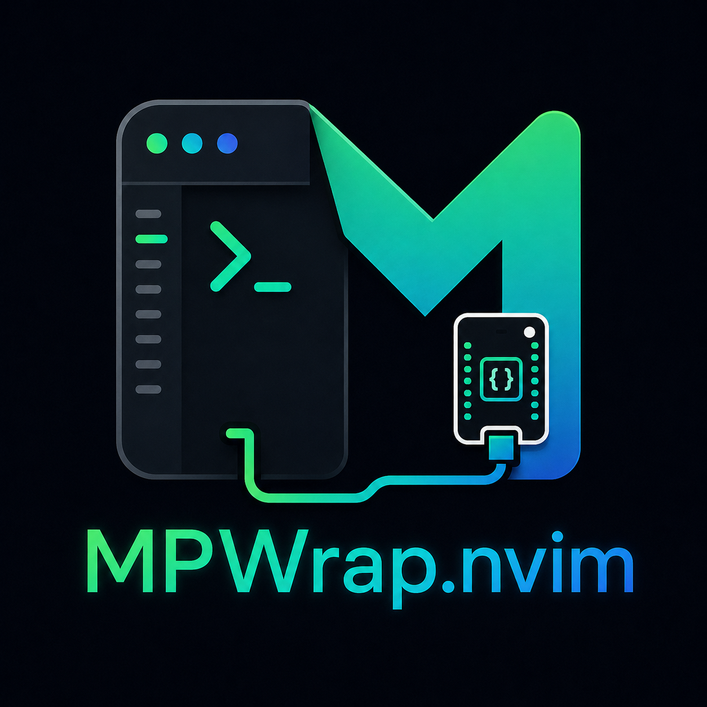

# mpwrap.nvim

[](https://github.com/barbera01/MPWrap/actions/workflows/ci.yml)
[](LICENSE)

<p align="center">
  
</p>

A Neovim plugin that provides an interactive side panel for working with MicroPython devices via `mpremote`.

This plugin acts as a quality-of-life wrapper around MicroPython's official `mpremote` tool, providing a native Neovim experience for embedded development workflows.

> **Note**: mpwrap.nvim is an independent project. It is not affiliated with, endorsed by, or maintained by the MicroPython project. [`mpremote`](https://docs.micropython.org/en/latest/reference/mpremote.html) is developed and maintained by the MicroPython team — this plugin only drives it as an external CLI.

## Features

- **Three-Pane UI**: Toggleable side panel with an action menu, filesystem browser, and live REPL, stacked top to bottom
- **Raw mpremote Menu**: Soft reset, RTC sync, disk usage, and one-line `exec` snippets, alongside the general panel actions
- **Highlighted Selection**: Current filesystem row and menu row are highlighted, dividers resize live with the panel
- **Filesystem Operations**: List, upload, download, delete (including recursive clear) files on your MicroPython device
- **Interactive REPL**: Full MicroPython REPL in a terminal buffer, with boot/`main.py` output visible on start
- **Async Operations**: Non-blocking command execution, guarded against overlapping invocations
- **Health Check**: `:checkhealth mpwrap` for Neovim/mpremote/device/config diagnostics
- **Keyboard-First**: Ergonomic keybindings for efficient workflow
- **Minimal**: No heavy dependencies, wraps existing `mpremote` CLI

## Prerequisites

mpwrap.nvim is only a front-end — everything that talks to the board is done by the `mpremote` CLI, which you install and manage yourself. Work through these once before using the plugin:

### 1. Neovim

- Neovim >= 0.8.0
- Developed and tested on macOS and Linux. Windows is untested (device ports like `COM3` are recognized, but no testing has been done there).

### 2. Install mpremote

`mpremote` is a Python tool published by the MicroPython project. Any of these works — pick whichever matches how you manage Python tools:

```bash
pipx install mpremote        # recommended: isolated, always on PATH
# or
pip install --user mpremote
# or
uv tool install mpremote
```

Verify it's reachable from a shell (and therefore from Neovim):

```bash
mpremote --version
```

If Neovim can't find it even though your shell can (common with pyenv/venv setups), point the plugin at the full path via the `mpremote_cmd` setup option.

### 3. Serial port access

- **Linux**: your user usually needs to be in the `dialout` (Debian/Ubuntu) or `uucp` (Arch) group:

  ```bash
  sudo usermod -a -G dialout $USER   # then log out and back in
  ```

- **macOS**: usually works out of the box. Some boards' USB-serial chips (CH340/CP210x) may need a driver on older macOS versions.

### 4. Verify the device connection

With your board plugged in:

```bash
mpremote connect list   # should list your board's port
mpremote ls             # should list files on the board
```

If both of those work in a terminal, the plugin will work. If they don't, fix that first — no plugin setting can help while the CLI itself can't reach the board.

Once installed, `:checkhealth mpwrap` re-checks all of the above from inside Neovim.

## Installation

### Using [lazy.nvim](https://github.com/folke/lazy.nvim)

```lua
{
  "barbera01/MPWrap",
  config = function()
    require("mpwrap").setup({
      -- Optional configuration
      mpremote_cmd = "mpremote",
      device = "auto", -- or explicit port like "/dev/ttyUSB0"
      panel_width = 50,
      repl_height_ratio = 0.4,
      keymaps = true,
    })
  end,
}
```

The plugin is small and `setup()` is cheap, so eager loading is the recommended spec. If you prefer `cmd = {...}` lazy-loading, note that `:checkhealth mpwrap` won't find the plugin's health module until something else triggers the load.

### Using [packer.nvim](https://github.com/wbthomason/packer.nvim)

```lua
use {
  "barbera01/MPWrap",
  config = function()
    require("mpwrap").setup()
  end
}
```

### Manual

Clone the repository into your Neovim plugin directory:

```bash
git clone https://github.com/barbera01/MPWrap.git \
  ~/.local/share/nvim/site/pack/plugins/start/mpwrap.nvim
```

Then add to your `init.lua`:

```lua
require("mpwrap").setup()
```

## Usage

### Commands

| Command                              | Description                     |
| ------------------------------------ | ------------------------------- |
| `:MpWrapToggle`                    | Toggle the MicroPython panel    |
| `:MpWrapOpen`                      | Open the MicroPython panel      |
| `:MpWrapClose`                     | Close the MicroPython panel     |
| `:MpWrapRepl`                      | Focus the REPL pane             |
| `:MpWrapReplStop`                  | Stop REPL and free serial port  |
| `:MpWrapFs`                        | Focus the filesystem pane       |
| `:MpWrapSyncBuffer [path]`         | Sync current buffer to device   |
| `:MpWrapUpload [path]`             | Alias for `:MpWrapSyncBuffer` |
| `:MpWrapSyncDir [local_dir]`       | Exact-mirror sync a directory (argument, or cwd) to remote root `:` |
| `:MpWrapDownload <remote> [local]` | Download file from device       |
| `:MpWrapVersion`                   | Show mpremote version           |
| `:MpWrapDevice`                    | Pick/select device port         |

The panel is three stacked windows: the **action menu** (top), the **filesystem browser** (middle), and the **REPL** (bottom). In normal mode, `<Tab>` moves forward and `<S-Tab>` moves backward through those panes without leaving the panel. Standard `<C-w>` window commands still work.

### Menu Pane

Two permanently visible sections. Move the cursor onto a row — it highlights — and press `<CR>` to run it:

**mpremote** — raw mpremote commands not otherwise wrapped by a panel action:

| Key | Action |
| --- | ------ |
| `1` | Soft reset device (`mpremote soft-reset`) |
| `2` | Sync device clock to local time (`mpremote rtc --set`) |
| `3` | Show disk usage (`mpremote df`) |
| `4` | Run a one-line Python snippet on the device (`mpremote exec`), prompted for; stopped automatically if it hasn't returned after 15s |

**Actions** — panel-level operations, same keys also usable directly from the filesystem pane below without switching windows:

| Key | Action |
| --- | ------ |
| `r` | Refresh filesystem listing |
| `u` | Sync current buffer to device |
| `S` | Browse local directories (defaults to last used, else cwd), exact-mirror sync selected directory to remote root (destructive; confirm required) |
| `m` | Create new directory |
| `-` | Go to parent directory |
| `C` | Clear all files in the current remote directory (with confirmation) |
| `x` | Restart the device (needed to bring a running program like a web server back after any filesystem action) |
| `R` | Start/focus the REPL |
| `s` | Stop the REPL so filesystem actions can use the serial port |
| `q` | Close the panel |

### Keybindings (Filesystem Pane)

When the filesystem pane is focused, these keybindings are available. All Menu Pane keys above also work here; the ones below are specific to the file/directory under the cursor:

| Key    | Action                                                     |
| ------ | ---------------------------------------------------------- |
| `<CR>` | Open file under cursor (downloads to cache and opens in main editor) |
| `a`    | Focus the menu pane                                        |
| `D`    | Download file under cursor to a local path                 |
| `M`    | Move file under cursor to a local path, deleting remote    |
| `dd`   | Delete file under cursor (with confirmation)               |

### REPL Pane

The REPL pane can start a full interactive MicroPython REPL:

- `<Esc><Esc>` - Exit terminal insert mode
- `<Tab>` / `<S-Tab>` - Move between panel panes in normal mode
- Standard terminal keybindings apply
- Plain `<Tab>` remains available for MicroPython completion while terminal-insert mode is active; press `<Esc><Esc>` before using pane navigation from a live REPL.
- The REPL does not start automatically by default, so the filesystem browser can connect reliably first.
- Press `R` in the filesystem pane or run `:MpWrapRepl` to start/focus the REPL.
- Stop the REPL before filesystem actions because `mpremote` uses exclusive serial-port access. Press `s` in the filesystem pane, then run the file action.

Uploads use the current in-memory buffer contents (including unsaved edits), by writing a temporary snapshot and cleaning it up after the transfer.

Downloads never overwrite an existing local file silently. Interactive commands prompt before overwrite.

Directory sync is an **exact mirror** from local directory to remote root (`:`). It reads directory files from disk, so save other modified buffers first. Remote-only files/directories are deleted after plan+confirmation.

## Configuration

Default configuration:

```lua
require("mpwrap").setup({
  -- Command to invoke mpremote (default: "mpremote")
  mpremote_cmd = "mpremote",

  -- Device selection
  -- "auto" = prompt to pick device on panel open by default
  -- "pick" = always prompt to pick device on panel open
  -- "/dev/ttyUSB0" = explicit port
  device = "auto",
  pick_device_on_open = true,

  -- Panel layout
  panel_width = 50,
  panel_position = "right", -- "left" or "right"
  repl_height_ratio = 0.4, -- REPL takes 40% of panel height
  auto_start_repl = false, -- keep filesystem actions reliable by default
  reset_on_repl_start = true, -- sends Ctrl-D once REPL connects, so
                               -- boot.py/main.py output shows in the pane

  -- Enable default keymaps
  keymaps = true,

  -- Customize keybindings
  keys = {
    next_section = "<Tab>",
    previous_section = "<S-Tab>",
    refresh = "r",
    upload = "u",
    sync_dir = "S",
    download = "D",
    move = "M",
    delete = "dd",
    clear_all = "C",
    restart_device = "x",
    action_menu = "a",
    start_repl = "R",
    stop_repl = "s",
    open = "<CR>",
    parent = "-",
    close_panel = "q",
    mkdir = "m",
  },

  -- Exact mirror directory sync ignores.
  -- sync_ignore REPLACES defaults when provided.
  -- sync_ignore_extra EXTENDS whichever base list is active
  -- (defaults, or your explicit sync_ignore replacement).
  -- Patterns without '/' match path components.
  -- Patterns with '/' match root-relative paths.
  sync_ignore = {
    ".git",
    ".hg",
    ".svn",
    "__pycache__",
    ".pytest_cache",
    ".mypy_cache",
    ".ruff_cache",
    "node_modules",
    "dist",
    "build",
    ".DS_Store",
    "*.swp",
    "*.swo",
    "*~",
  },
  sync_ignore_extra = {},
})
```

`sync_ignore` replaces the built-in ignore list when explicitly configured;
`sync_ignore_extra` appends patterns to the active list. Ignored local paths are
excluded from the mirror, so matching paths that exist only on the device may
be deleted as remote-only entries after confirmation.

## Example Workflow

1. Open the panel:

   ```vim
   :MpWrapToggle
   ```

2. The panel shows:
   - **Top**: Action menu (raw mpremote + panel actions)
   - **Middle**: Filesystem browser listing files on your device
   - **Bottom**: Live MicroPython REPL

3. Navigate the filesystem:
   - Use `j`/`k` to move between files
   - Press `<CR>` to download and open a file
   - Edit the file locally

4. Upload changes:
   - With the edited buffer focused, press `u` in the filesystem pane
   - Or use `:MpWrapSyncBuffer` (`:MpWrapUpload` alias)

5. Test code in REPL:
   - Click into REPL pane or use `:MpWrapRepl`
   - Run your MicroPython code interactively

## Architecture

```
lua/mpwrap/
├── init.lua      # Main entry point, commands
├── config.lua    # Configuration management + validation
├── jobs.lua      # Async command execution, serial lease
├── fs.lua        # Filesystem operations, directory sync
├── repl.lua      # REPL terminal management
├── panel.lua     # UI layout and window management
├── devices.lua   # Device discovery and picker
└── health.lua    # :checkhealth mpwrap provider

plugin/
└── mpwrap.lua    # Plugin metadata

doc/
└── mpwrap.txt    # :h mpwrap
```

### Module Overview

- **config.lua**: Manages user configuration and builds mpremote commands
- **jobs.lua**: Handles async execution of mpremote CLI commands
- **fs.lua**: Wraps mpremote filesystem operations (ls, cp, rm, mkdir)
- **repl.lua**: Manages the terminal buffer running mpremote REPL
- **panel.lua**: Creates and manages the split panel UI layout
- **init.lua**: Exposes public API and user commands
- **devices.lua**: Parses `mpremote connect list` and drives the device picker
- **health.lua**: Backs `:checkhealth mpwrap`

## Advanced Usage

### Programmatic API

You can access the plugin's modules directly:

```lua
local mpremote = require("mpwrap")

-- Upload a specific file
mpremote.fs.upload("/path/to/local/file.py", ":/remote/file.py", function(success, error)
  if success then
    print("Upload successful")
  end
end)

-- List files
mpremote.fs.list(":", function(success, entries, error)
  for _, entry in ipairs(entries) do
    print(entry.name, entry.type, entry.size)
  end
end)

-- Send command to REPL
mpremote.repl.send("print('Hello from MicroPython!')")
```

### Custom Keybindings

Disable default keybindings and define your own:

```lua
require("mpwrap").setup({
  keymaps = false, -- Disable defaults
})

-- Define custom keybindings
vim.keymap.set("n", "<leader>mp", "<cmd>MpWrapToggle<cr>", { desc = "Toggle panel" })
vim.keymap.set("n", "<leader>mb", "<cmd>MpWrapSyncBuffer<cr>", { desc = "Sync buffer" })
vim.keymap.set("n", "<leader>md", "<cmd>MpWrapSyncDir<cr>", { desc = "Sync directory" })
vim.keymap.set("n", "<leader>mr", "<cmd>MpWrapRepl<cr>", { desc = "Open REPL" })
```

### WhichKey

MPWrap does not require WhichKey or claim a global leader prefix. If you use
[which-key.nvim](https://github.com/folke/which-key.nvim), register the group
heading in `lua/plugins/which-key.lua`:

```lua
return {
  "folke/which-key.nvim",
  opts = function(_, opts)
    opts.spec = opts.spec or {}
    vim.list_extend(opts.spec, {
      { "<leader>m", group = "MPWrap" },
    })
    return opts
  end,
}
```

Then define the menu entries as mappings with descriptions in
`lua/plugins/mpwrap.lua`:

```lua
config = function()
  require("mpwrap").setup({
    panel_width = 50,
    keymaps = true,
  })

  vim.keymap.set("n", "<leader>mp", "<cmd>MpWrapToggle<cr>", { desc = "Toggle panel" })
  vim.keymap.set("n", "<leader>mr", "<cmd>MpWrapRepl<cr>", { desc = "Open REPL" })
  vim.keymap.set("n", "<leader>ms", "<cmd>MpWrapReplStop<cr>", { desc = "Stop REPL" })
  vim.keymap.set("n", "<leader>mf", "<cmd>MpWrapFs<cr>", { desc = "Focus filesystem" })
  vim.keymap.set("n", "<leader>mb", "<cmd>MpWrapSyncBuffer<cr>", { desc = "Sync buffer" })
  vim.keymap.set("n", "<leader>md", "<cmd>MpWrapSyncDir<cr>", { desc = "Sync directory" })
  vim.keymap.set("n", "<leader>mc", "<cmd>MpWrapClose<cr>", { desc = "Close panel" })
  vim.keymap.set("n", "<leader>mv", "<cmd>MpWrapVersion<cr>", { desc = "Show version" })
  vim.keymap.set("n", "<leader>mD", "<cmd>MpWrapDevice<cr>", { desc = "Select device" })
end
```

WhichKey generates the rows from each mapping's `desc`; the group declaration
only supplies the `MPWrap` heading.

### Multiple Devices

Switch devices with:

```vim
:MpWrapDevice
```

Or set policy/explicit port via `setup()`:

```lua
require("mpwrap").setup({ device = "pick" })      -- always prompt on open
require("mpwrap").setup({ device = "/dev/ttyUSB0" }) -- explicit fixed port
```

## Troubleshooting

### mpremote not found

Ensure mpremote is installed:

```bash
pip install mpremote
which mpremote
```

### Device not detected

Explicitly specify the device port:

```lua
require("mpwrap").setup({
  device = "/dev/ttyUSB0" -- Linux/macOS
  -- or
  device = "COM3" -- Windows
})
```

### Permission denied (Linux)

Add your user to the dialout group:

```bash
sudo usermod -a -G dialout $USER
```

Then log out and back in.

## Inspiration

This plugin draws inspiration from:

- [nvim-tree.lua](https://github.com/nvim-tree/nvim-tree.lua) - File explorer UI
- [toggleterm.nvim](https://github.com/akinsho/toggleterm.nvim) - Terminal management
- [nvim-dap-ui](https://github.com/rcarriga/nvim-dap-ui) - Split panel layout

## Contributing

Contributions are welcome! Please open an issue or pull request.

## License

MIT License - See LICENSE file for details

## Roadmap

Future enhancements (not in MVP):

- [ ] Tree-style directory navigation
- [ ] File watching and auto-sync
- [x] Soft reset / hard reset commands - menu pane's mpremote section (`1`) and Actions section (`x`)
- [ ] Live-mount a local directory on the device (`mpremote mount`) for iterative dev without re-uploading each file
- [ ] Multiple device support (tabs)
- [ ] Syntax highlighting for remote files
- [ ] Integration with nvim-dap for debugging

## Support

If you encounter issues or have questions:

1. Check the [Troubleshooting](#troubleshooting) section
2. Review [mpremote documentation](https://docs.micropython.org/en/latest/reference/mpremote.html)
3. Open an issue on the repository

---

**Note**: This plugin is a wrapper around `mpremote` and requires a working MicroPython device connection. It does not reimplement the mpremote protocol.
